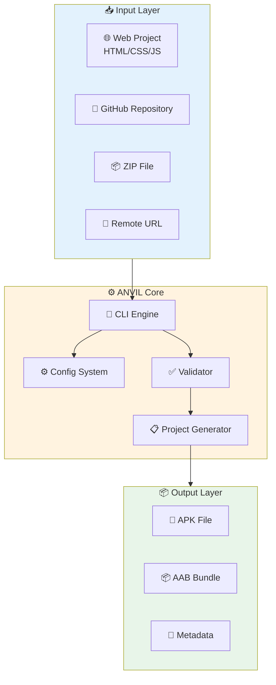
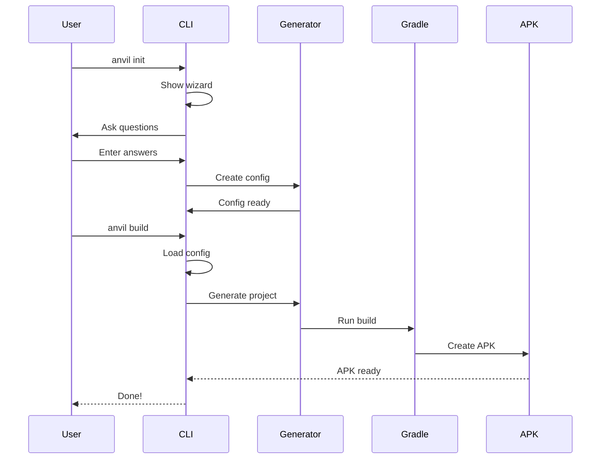
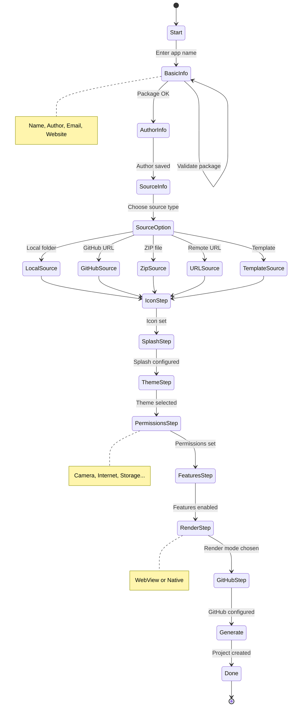
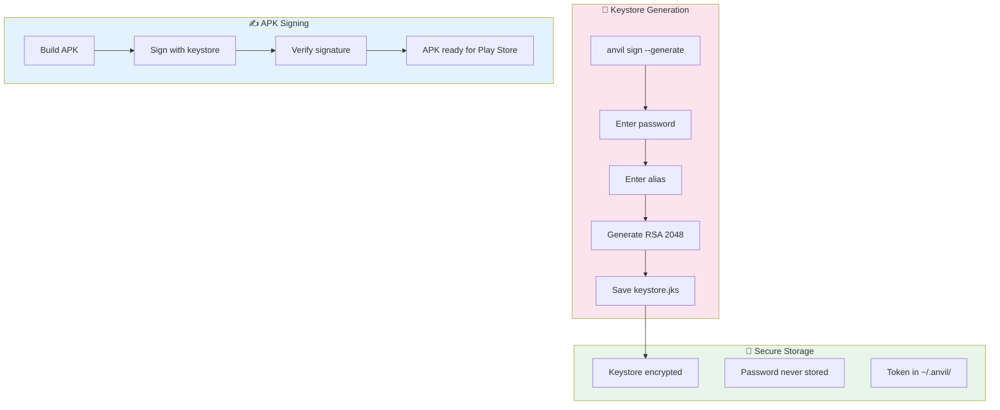
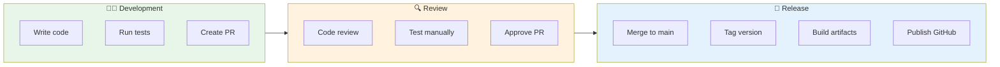

# 📋 ANVIL - Technical Specification

```text
    _   _  _     _  ___  _      
   / \ | \ | || |   | ||_ _|| |     
  / _ \|  \| || |   | | | | | |     
 / ___ \ |\  | \ \ / /  | | | |___  
/_/   \_\|_| \_|  \___/  |___||_____| 
```

> Complete technical documentation for the ANVIL CLI tool

---

## 🎯 Overview

**ANVIL** transforms websites (HTML/CSS/JS) into production-ready Android APKs without Android Studio.

### Key Features

- 📱 **Mobile-first**: Works on Termux/Android devices
- 🌐 **4 Languages**: English, Portuguese, Spanish, Mandarin
- ⚡ **Fast**: Quick builds from GitHub, ZIP, URL
- 🔐 **Secure**: Built-in keystore generation
- 🎨 **Professional**: Auto icons, themes, permissions

---

## 🏗️ System Architecture



---

## 📁 Directory Structure

```
anvil/
├── anvil_cli.py           # 🔥 Main entry point
├── setup.py               # 📦 Python package
├── install.sh             # 🚀 Installer
├── README.md              # 📖 User docs
├── SPEC.md                # 📋 This spec
│
├── anvil/
│   ├── cli/               # 📋 Commands
│   │   ├── init.py        # 🆕 Create project
│   │   ├── build.py       # 🔨 Build APK
│   │   ├── sign.py        # 🔐 Sign APK
│   │   ├── doctor.py      # 🔍 System check
│   │   ├── preview.py      # 👀 Preview app
│   │   ├── deploy.py      # 📱 Deploy device
│   │   ├── config.py       # ⚙️ Config edit
│   │   ├── plugin.py      # 🔌 Plugins
│   │   ├── setup.py       # 🔧 Setup wizard
│   │   ├── lang.py         # 🌐 Languages
│   │   └── quick_build.py # ⚡ Fast build
│   │
│   ├── utils/             # 🛠️ Utilities
│   │   ├── generator.py   # 📋 Project gen
│   │   ├── i18n.py        # 🌐 i18n system
│   │   ├── github.py      # 🐙 GitHub API
│   │   └── mobile.py      # 📱 Mobile detect
│   │
│   └── templates/         # 📁 Templates
│       └── android/       # 🤖 Android template
│           ├── app/
│           │   ├── build.gradle
│           │   └── src/main/
│           │               ├── AndroidManifest.xml
│           │               ├── java/
│           │               └── res/
│           ├── build.gradle
│           ├── gradle/wrapper/
│           ├── gradlew
│           └── settings.gradle
│
└── dist/                   # 📦 Build output
```

---

## 🔄 Command Flow Diagram



---

## 📊 Init Wizard State Machine



---

## 🧠 Decision Matrix

| Scenario | Action | Result |
|----------|--------|--------|
| New user | `anvil init` | Interactive wizard |
| Existing project | `anvil build` | Build APK |
| First time setup | `anvil doctor` | System check |
| Mobile build | `anvil build --low-memory` | Optimized build |
| Quick test | `anvil preview` | Browser preview |
| GitHub repo | `anvil quick-build --url URL` | Fast build |
| Change language | `anvil lang --set pt` | Switch to Portuguese |
| Sign APK | `anvil sign --generate` | Create keystore |
| Install device | `anvil deploy` | ADB install |

---

## 🔧 Configuration Schema

### Project Config (`anvil.config.json`)

```json
{
  "$schema": "https://anvil.dev/schema.json",
  "name": "string (required)",
  "author": "string (optional)",
  "authorEmail": "string (optional)",
  "website": "string (optional)",
  "package": "string (required, format: com.domain.app)",
  "version": "string (semver, default: 1.0.0)",
  "description": "string (optional)",
  
  "renderMode": "webview | native",
  "language": "kotlin | java (for native mode)",
  
  "theme": "light | dark | system",
  "icon": "string (path to PNG, min 512x512)",
  
  "splash": {
    "enabled": "boolean",
    "color": "string (hex color)",
    "image": "string (optional path)"
  },
  
  "permissions": [
    "camera",
    "storage",
    "bluetooth",
    "notifications",
    "contacts",
    "location",
    "microphone",
    "internet"
  ],
  
  "features": [
    "pull-to-refresh",
    "offline-cache",
    "ota-updates",
    "deep-links",
    "biometric"
  ],
  
  "webview": {
    "mode": "local | remote | hybrid",
    "url": "string (for remote/hybrid)",
    "cache": "boolean"
  },
  
  "publish": {
    "github": "boolean",
    "private": "boolean"
  }
}
```

### Global Config (`~/.anvil/config.json`)

```json
{
  "language": "en | pt | es | zh",
  "github_username": "string",
  "github_token": "string (encrypted)",
  "theme": "light | dark | system",
  "android_sdk": "string (path)",
  "java_home": "string (path)",
  "low_memory_mode": "boolean"
}
```

---

## 📱 Platform Support Matrix

| Platform | Version | Status | Install | Notes |
|----------|---------|--------|---------|-------|
| **Termux** | Android 7+ | ✅ Stable | curl\|bash | Mobile hero |
| **Ubuntu** | 20.04+ | ✅ Stable | curl\|bash | Desktop |
| **Debian** | 10+ | ✅ Stable | curl\|bash | Desktop |
| **Fedora** | 34+ | ✅ Stable | curl\|bash | Desktop |
| **macOS** | 11+ | ✅ Stable | curl\|bash | Desktop |
| **WSL** | WSL2 | ✅ Stable | curl\|bash | Windows |
| **Docker** | 20+ | ✅ Stable | docker run | Container |

---

## 🌐 Internationalization

### Language Codes

| Code | Language | Native | Status |
|------|----------|--------|--------|
| `en` | English | English | ✅ Default |
| `pt` | Portuguese | Português | ✅ |
| `es` | Spanish | Español | ✅ |
| `zh` | Mandarin | 中文 | ✅ |

### Translation Keys (Sample)

```python
TRANSLATIONS = {
    "en": {
        "cli_name": "ANVIL",
        "init_title": "Project Init Wizard",
        "init_app_name": "App name",
        "init_package": "Package ID",
        "build_success": "APK built successfully!",
        "error_no_java": "Java not found. Install OpenJDK.",
    },
    "pt": {
        "cli_name": "ANVIL",
        "init_title": "Assistente de Projeto",
        "init_app_name": "Nome do app",
        "init_package": "ID do pacote",
        "build_success": "APK compilado com sucesso!",
        "error_no_java": "Java não encontrado. Instale o OpenJDK.",
    }
}
```

---

## 🔌 Plugin System

### Available Plugins

| Plugin | Description | Status |
|--------|-------------|--------|
| `camera` | Camera access | ✅ |
| `firebase` | FCM push notifications | 🚧 |
| `biometric` | Fingerprint auth | ✅ |
| `push` | Local notifications | ✅ |
| `analytics` | App analytics | 🚧 |
| `crashlytics` | Crash reporting | 🚧 |
| `ads` | AdMob integration | 🚧 |
| `payment` | In-app purchases | 🚧 |

### Plugin Interface

```python
class Plugin:
    name: str
    version: str
    dependencies: List[str]
    
    def install(self, project_dir: Path) -> bool:
        """Install plugin to project"""
        pass
    
    def uninstall(self, project_dir: Path) -> bool:
        """Remove plugin from project"""
        pass
    
    def configure(self, config: dict) -> dict:
        """Configure plugin settings"""
        pass
```

---

## 🔐 Security Model



---

## 📊 Build Performance

| Project Size | Desktop Build | Mobile Build |
|--------------|---------------|--------------|
| Small (<1MB) | ~30s | ~60s |
| Medium (1-10MB) | ~1min | ~2min |
| Large (10-50MB) | ~3min | ~5min |
| XL (50MB+) | ~10min | ~15min |

---

## 🧪 Testing Matrix

| Test | Desktop | Mobile | CI |
|------|---------|--------|-----|
| Unit tests | ✅ | ✅ | ✅ |
| Integration tests | ✅ | ⚠️ | ✅ |
| Build tests | ✅ | ✅ | ✅ |
| APK signing | ✅ | ✅ | ✅ |
| OTA updates | ✅ | ✅ | ❌ |

---

## 🚀 Release Process



---

## 📈 Future Roadmap

### v0.3.0 (Planned)
- [ ] Native APK mode (stable)
- [ ] Flutter template
- [ ] Vue template
- [ ] Hot reload preview

### v0.4.0 (Planned)
- [ ] Plugin marketplace
- [ ] Cloud build
- [ ] Multi-arch builds
- [ ] App signing service

### v1.0.0 (Target)
- [ ] Stable native mode
- [ ] Play Store publishing
- [ ] Enterprise features
- [ ] API documentation

---

## 🤝 Contributing

See [CONTRIBUTING.md](CONTRIBUTING.md) for guidelines.

---

## 📄 License

MIT License - See [LICENSE](LICENSE) for details.

---

<p align="center">
  <strong>ANVIL v0.2.0</strong>
  <br>
  Built with ❤️ for developers worldwide
</p>